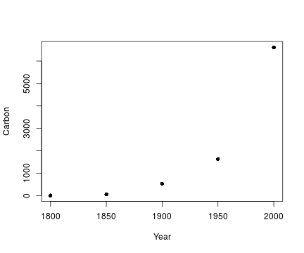
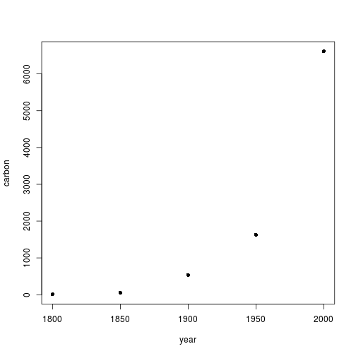

Introducción a R
========================================================
author: Héctor Garrido Henríquez.
date: 29 de noviembre de 2016
font-import: http://fonts.googleapis.com/css?family=Risque
font-family: 'Risque'
Observatorio Laboral Ñuble

R como una calculadora
========================================================


```r
2+2
```

```
[1] 4
```

```r
2*3*4*5
```

```
[1] 120
```

```r
sqrt(10) #La ra?z cuadrada de 10
```

```
[1] 3.162278
```

```r
pi# entrega el valor de pi
```

```
[1] 3.141593
```

R como una calculadora
========================================================


```r
2*pi*6378 #Circunferencia de la tierra (radio=6378Kms)#
```

```
[1] 40074.16
```

```r
3*4^2
```

```
[1] 48
```

```r
3*4^2; (3*4)^2
```

```
[1] 48
```

```
[1] 144
```

¿Cómo ingresar datos?
========================================================
class:ilustration

Ejemplo: Emisiones de Carbon como resultado del uso de combustibles fosiles


```r
Year<-c(1800,1850,1900,1950,2000)
Year
```

```
[1] 1800 1850 1900 1950 2000
```

```r
Carbon<-c(8,54,534,1630,6611)
Carbon
```

```
[1]    8   54  534 1630 6611
```


Un diagrama sencillo de dispersión
========================================

Graficamos Carbon en función de Year

```r
plot(Carbon~Year,pch=16)
```



Un diagrama sencillo de dispersión 
========================================

Algunas observaciones

  - Year y Carbon son vectores que son formados concatenando números separados (c())
  - El Grafico Carbon~Year, significa Carbon en función de Year
  - pch=16, significa plot character, generando un punto negro solido #

Construcción de un Data Frame
=======================================

Se unen los dos vectores Year y Carbon, utilizando la función data frame


```r
fossilfuel<-data.frame(year=Year, carbon=Carbon)
fossilfuel #muestra los contenidos del data frame
```

```
  year carbon
1 1800      8
2 1850     54
3 1900    534
4 1950   1630
5 2000   6611
```

Construcción de un Data Frame 
=====================================

muestra el rango de los datos de carbon ($ es un conector)

  - El rango nos muestra los datos máximo y mínimo


```r
range(fossilfuel$carbon) 
```

```
[1]    8 6611
```

Podemos remover los vectores que ahora ya no sirven

```r
rm(Year, Carbon)  
```

  - La función rm() remueve los objetos no deseados

La misma gráfica anterior 
===================================

```r
plot(carbon~year, data=fossilfuel, pch=16) #Gr?fico de la emisi?n de carbon en el tiempo#
```



Manipulación de carácteres
================================

Ejemplo: Cuatro ciudades

```r
cuatrociudades<-c("Talca","Concepción","Chillán", "Los Angeles")
sort(cuatrociudades) 
```

```
[1] "Chillán"     "Concepción"  "Los Angeles" "Talca"      
```

Manipulación de carácteres
====================================

Ejemplo: Cuatro ciudades

sort ordena las ciudades en orden alfabético

```r
nchar("Talca") #muestra el n?mero de letras en Talca
```

```
[1] 5
```

```r
nchar(cuatrociudades) #muestra el n?mero de letras de cada ciudad
```

```
[1]  5 10  7 11
```

¿Qué son los paquetes?
===============================================

Los paquetes son colecciones de funciones de R, datos y código compilado en un formato bien definido.
  - El directorio donde están alojados los paquetes se denomina librería
  - R por defecto trae un conjunto de paquetes básicos 
  - Una infinidad de paquetes están disponibles para su descarga e instalación 
  - Una vez instalados, deben ser cargados en la sesión para poder trabajar con ellos.

¿Qué son los paquetes?
====================================

Para ver todos los paquetes instalados podemos tipear

```r
library()
```
Mientras que para ver los paquetes que están cargados 

```r
search()
```

Instalando un paquete
==========================
Utilizaremos el paquete 'Daag'

```r
install.packages("DAAG") #Para instalar el paquete
```
  - Para cargarlo en nuestra sesión de trabajo 


```
Error in library(DAAG) : there is no package called 'DAAG'
```
